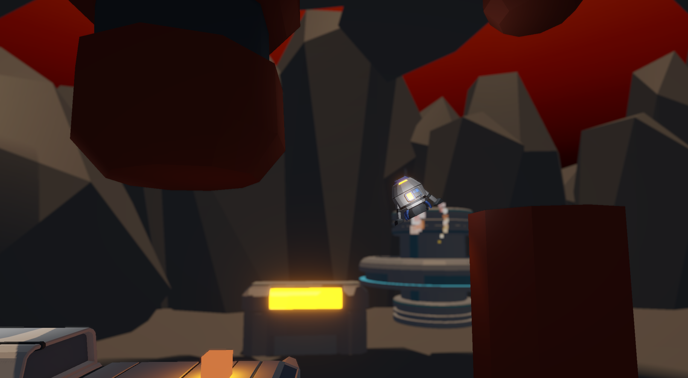
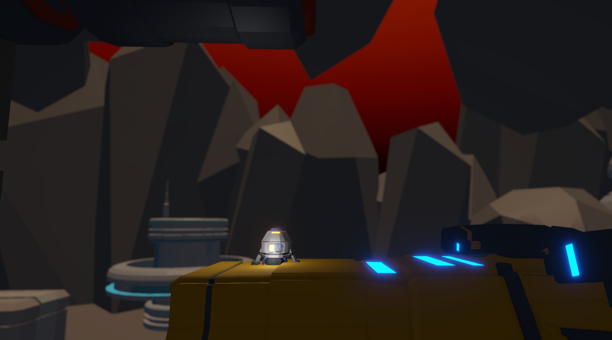
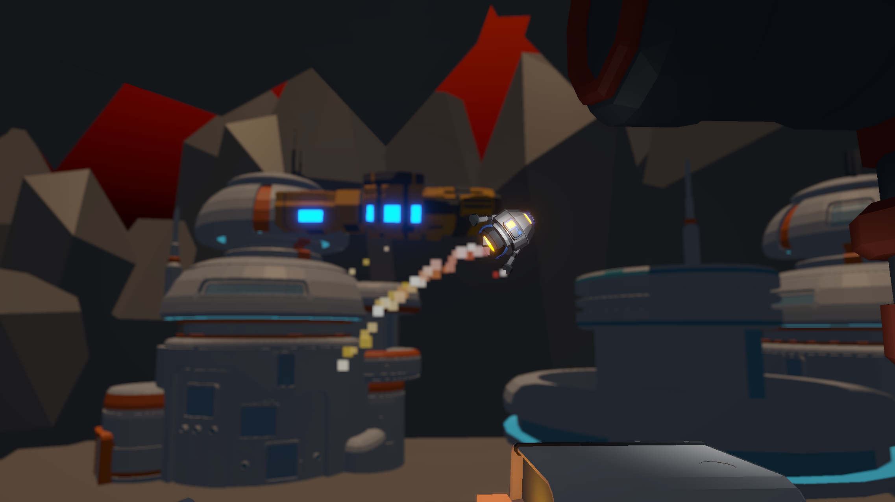

# Spaceship_Boost_3D_Game
Side View 3D Space Ship Boost Game where you need to avoid obstacles.
The game prototype features 3 Levels and can be expanded with multiple features.

## Screenshots

## To Play the Game 
- Use A key for moving LEFT
- Use D key for moving RIGHT
- Use Space key for MAIN ENGINE
- Use ESC key for EXIT
- Use N key to LOAD NEXT LEVEL
- Use C key to TURN OFF COLLISION

## How to Play?
- Download the Project
- Open Folder Named "Windows Build".
- Click on Spaceship_Boost_3D.exe.

## Tools used while developing this project
- Unity.
- Visual Studio Code. Coding in C# Programming Language.
- GitBash.
- Audacity
  
## Contacts 
- E-mail address orkhan.elchuev@gmail.com
- https://github.com/OrkhanElchuev/Spookland
  
## Acknowledgements
- [freesound](https://freesound.org/)
- [Assets](https://gamedev.tv/products?srsltid=AfmBOoroFt5M-VUX7G0p7o2yY7CODfqRPnm8LfVGZxStmvfLEmCHxYU7&page=1)
